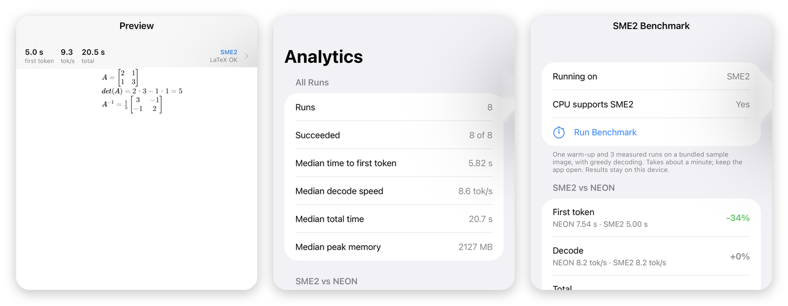
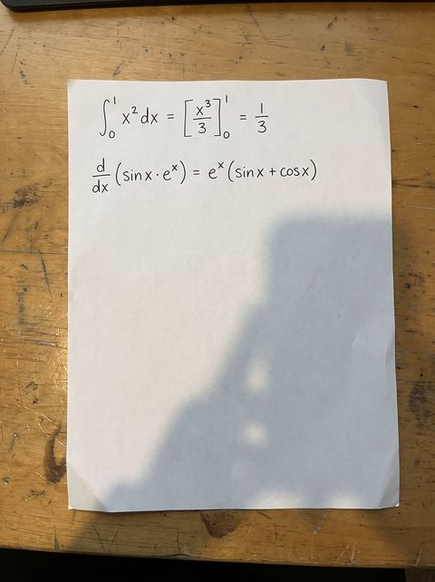
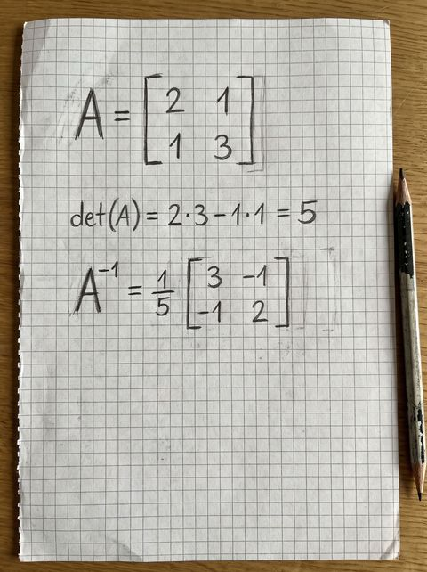
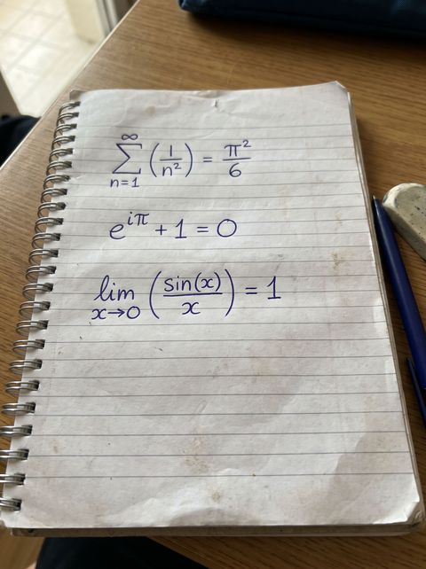
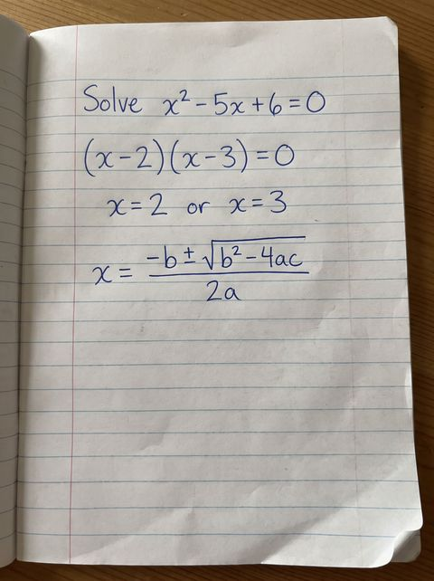
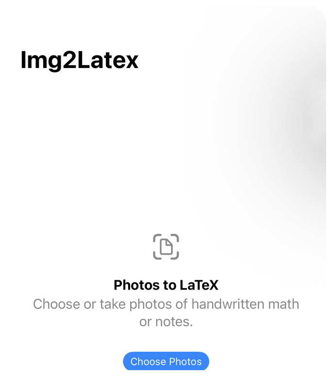
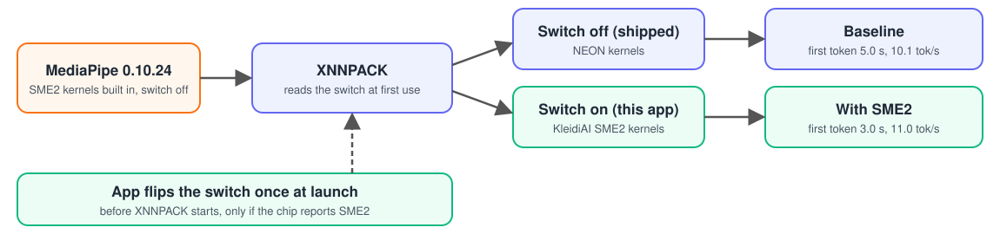
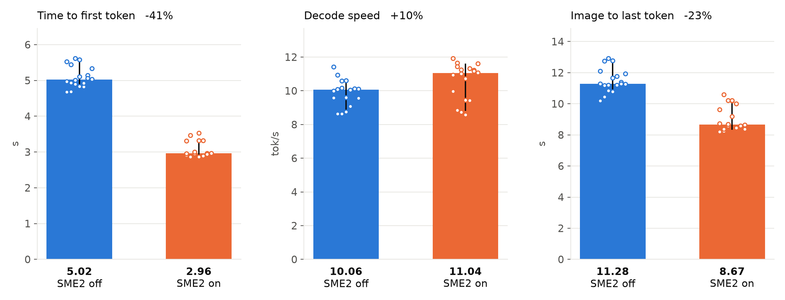
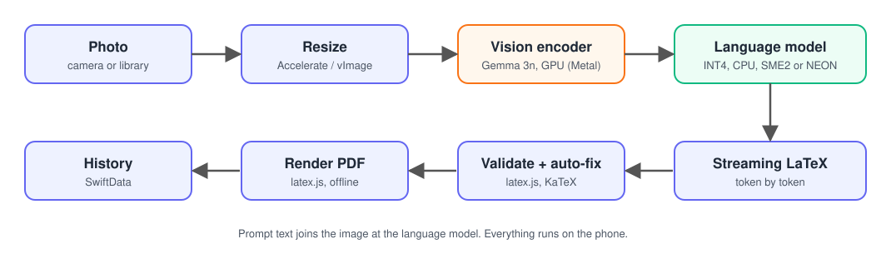

# Img2LaTeX

**Photograph handwritten math, get LaTeX and a PDF. Everything runs on the phone: no server, no account, no network after the model download.**

[](https://developer.arm.com/Architectures/Scalable%20Matrix%20Extension)
[](#privacy)
[](https://huggingface.co/google/gemma-3n-E2B-it-litert-preview)
[](https://developers.google.com/mediapipe)
[](LICENSE)

[**Download on the App Store**](https://apps.apple.com/ca/app/img2latex/id6754800282) · [Research write-up](research/README.md) · [Privacy](PRIVACY.md)



*Real screenshots from an iPhone 16 Pro Max. Left: a generated matrix, rendered offline. Middle: per-run analytics. Right: the built-in SME2 vs NEON benchmark.*

> Arm and the Arm logo are trademarks of Arm Limited. This is an independent project and is not endorsed by or affiliated with Arm.

## What it does

1. Take or pick a photo of handwritten or printed math.
2. A vision-language model ([Gemma 3n E2B](https://ai.google.dev/gemma/docs/gemma-3n), INT4) reads it on the phone and streams LaTeX as it goes.
3. The LaTeX is checked, repaired if needed, and rendered to a PDF you can share.

| Photo | | What the app produces |
|---|---|---|
|  | → | `\int_0^1 x^2\,dx = \left[\frac{x^3}{3}\right]_0^1 = \frac13`, `\frac{d}{dx}(\sin x\cdot e^x) = e^x(\sin x+\cos x)` |
|  | → | A, det(A) and A⁻¹ as typeset matrices (see the preview in the picture above) |
|  | → | The series and its sum, typeset |
|  | → | The quadratic and its roots, typeset |



## Arm SME2

Some newer Arm chips have **SME2**, Arm's Scalable Matrix Extension 2, which can multiply matrices much faster than the older NEON instructions. It was confirmed on the A18 Pro in the iPhone 16 Pro Max used here; the app asks the chip at launch whether it supports SME2 instead of going by model name, and falls back to NEON when it does not.

The AI runtime this app uses (MediaPipe → XNNPACK → Arm KleidiAI) already contains SME2 kernels, but **ships with them switched off** on iOS. Img2LaTeX switches them on at launch when the chip supports SME2 (`Pic2PDF/SME2/`). There is a toggle in Settings, a label on the Generate screen that says which one is running, and a benchmark in the Analytics tab that measures both on your own phone.



### Measured on an iPhone 16 Pro Max

Same photo, same prompt, greedy decoding, 64 output tokens, 18 measured runs per setting, baseline and SME2 alternated across 6 separate processes each:

| | NEON (default MediaPipe) | SME2 | Change |
|---|---|---|---|
| Time to first token (median) | 5.02 s | 2.96 s | **−41 %** |
| Decode speed (median) | 10.1 tok/s | 11.0 tok/s | +9.7 % |
| Whole generate call (median) | 11.3 s | 8.7 s | **−23 %** |
| Peak memory | 1841 MB | 1868 MB | +1.5 % |



What this means in plain terms:

- **The wait before text starts appearing drops by about 40 %.** That is the phase where the model reads the image and the prompt, which is large matrix work, and SME2 helps there.
- **Writing the answer speeds up only a little.** Producing one token at a time is limited by how fast weights can be read from memory, not by arithmetic. Also, the INT4 weight layers in this model still run on NEON in this MediaPipe build; only the float and INT8 layers move to SME2.
- **Caveats.** One phone, one model, one image. The phone was warm for most of the session (12 of 18 baseline and 14 of 18 SME2 runs started in the "serious" thermal state), so absolute speeds are lower than on a cool phone. Alternating the two settings keeps that from favouring either. Full method, raw data and scripts: [`research/`](research/README.md).

### The weight-cache trap

XNNPACK saves repacked weights next to the model (`<model>.xnnpack_cache`). The file is **not** tagged with the instruction set it was built for, so a cache built with NEON and loaded with SME2 (or the reverse) crashes with SIGABRT. The app records which mode built the cache, deletes it when the mode changes, and keeps a `.loading` marker so a crash during load cleans up after itself.

## How it works



- **Inference:** MediaPipe Tasks GenAI 0.10.24 (`OnDeviceLLMService.swift`). The language model runs on the CPU; part of the vision pipeline runs on the GPU through Metal.
- **Output cleanup** (`Pic2PDF/LaTeX/`): small models sometimes loop or stop mid-sentence. `LaTeXAutoFixer` collapses runaway repetition, drops a truncated tail, closes open environments and wraps stray math in `$…$`. `LaTeXValidator` checks the result with latex.js and KaTeX before it is shown.
- **Rendering:** [latex.js](https://latex.js.org) is bundled in the app (`LatexJS.bundle`) and served to a `WKWebView` through a custom URL scheme, so previews work in Airplane Mode.
- **Diagnostics** (`Pic2PDF/Diagnostics/`): every run records timings, token counts, peak memory, thermal state and which fixes were applied. They stay on the phone, show up in Analytics, and can be exported as JSON or CSV.
- **Storage:** SwiftData history with search and favourites.

## Build it

Requirements: Xcode 16+, CocoaPods, an iPhone running iOS 17+ (a phone with an SME2-capable chip, such as the A18 Pro, to see SME2).

```bash
git clone https://github.com/younes-laaroussi/Pic2PDF.git
cd Pic2PDF
pod install
open Pic2PDF.xcworkspace
```

The model is not in the repository. Either download it inside the app (Settings → Models), or fetch `gemma-3n-E2B-it-int4.task` (about 3.1 GB) from [Hugging Face](https://huggingface.co/google/gemma-3n-E2B-it-litert-preview) and copy it to the app's `Documents/Models/` folder. The built-in download URLs in `ModelConfig.swift` are placeholders; point them at your own host if you want the in-app downloader.

### The iOS Simulator

The app builds and runs in the Simulator, but **transcription does not work there**: the MediaPipe vision path copies the image through Metal, and under the Simulator that copy produces an all-black image, so the model sees nothing. Use a real iPhone for anything involving photos. The preview, history, analytics and LaTeX auto-fixer all work in the Simulator.

## Repository layout

```
Pic2PDF/                 App source
  SME2/                  SME2 switch, C shim into XNNPACK, in-app benchmark
  LaTeX/                 Validator, auto-fixer, sanitizer, latex.js asset loader
  Diagnostics/           Per-run diagnostics model and views
  LatexJS.bundle/        latex.js 0.12.6 (MIT) for offline rendering
research/                SME2 investigation: method, raw data, scripts, evidence
docs/images/             Screenshots used in this README
PRIVACY.md
```

## Limitations

- Accuracy depends on handwriting and on a small 2-billion-parameter model; always read the result before relying on it. Long pages and dense tables are the weakest cases.
- MediaPipe 0.10.24 cannot cancel a generation in progress.
- The first model load builds a weight cache and takes noticeably longer than later loads.
- SME2 measurements are from one device. Other SME2 chips are expected to behave similarly but have not been measured.

## Privacy

No accounts, no analytics, no uploads. Photos, LaTeX and diagnostics stay on the phone; the only network use is the one-time model download. See [PRIVACY.md](PRIVACY.md).

## Acknowledgements

- [Gemma 3n](https://ai.google.dev/gemma) by Google, used under the Gemma terms of use.
- [MediaPipe](https://developers.google.com/mediapipe), [XNNPACK](https://github.com/google/XNNPACK) and Arm's [KleidiAI](https://gitlab.arm.com/kleidi/kleidiai).
- [latex.js](https://github.com/michael-brade/LaTeX.js) (MIT) and [KaTeX](https://katex.org) (MIT), including its fonts, and the Computer Modern fonts.
- [ZIPFoundation](https://github.com/weichsel/ZIPFoundation).

## License

MIT, see [LICENSE](LICENSE). Third-party components keep their own licenses.
